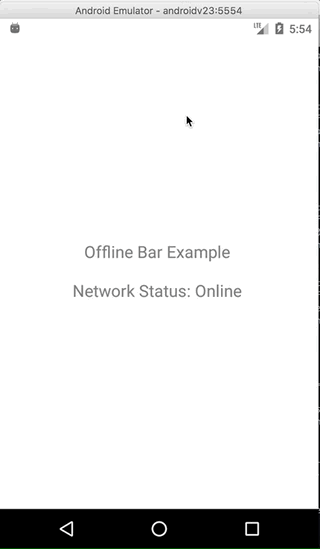

# react-native-offline-status
- A status bar which shows up on top when the device is offline.
- Works on both android and iOS without any extra configuration.
- Highlight(shake) feature.
- Simple/Minimalistic installation.

## Demo


## Props

-  offlineText: String(Text to show on the bar, default is: `You are not connected to Internet`)

## Usage

- Install the module: `yarn add react-native-offline-status` or `npm install react-native-offline-status --save`

- Import the component and add it to the root level of your app

```js
import OfflineBar from 'react-native-offline-status';

export default AppContainer {
  render() {
    return (
      <View>
        <OfflineBar />
        ...
      <View/>
    )
  }
}
```

- Triggering the animation

```js
<OfflineBar ref={(r) => this.offlineBarRef = r} />
{this.offlineBarRef && <Button title='Highlight Bar' onPress={this.offlineBarRef.triggerAnimation} /> title />}
```

- Getting the network state: `this.offlineBarRef.state.isConnected` will return true/false is the device is connected/disconnected.
